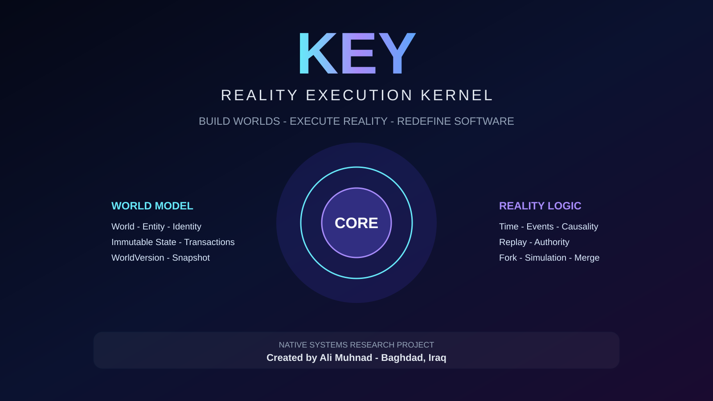

# KEY — Reality Execution Kernel

> **Build worlds. Execute reality. Redefine software.**

**KEY** is an experimental native programming language and execution architecture created by **Ali Muhnad** in Baghdad, Iraq.

KEY explores a different model for building complex software: instead of treating systems as disconnected databases, APIs, permissions, logs, workflows, and simulations, KEY is designed around **executable worlds** whose core concepts—identity, state, time, events, causality, authority, replay, snapshots, and forks—are part of the execution model itself.

---

## Why KEY Could Become a New Software Infrastructure Layer

Most enterprise software is assembled from separate systems for state, permissions, events, audit, history, workflow, causality, and simulation.

KEY is being designed to make many of those concepts part of one coherent execution model.

That creates a potential platform opportunity:

- **Fewer disconnected infrastructure layers** — core semantics such as state, time, authority, causality, and replay can live in one architecture.
- **Stronger auditability** — transactions, versions, events, authority evidence, and replay are designed to be explicit rather than reconstructed after the fact.
- **Safer experimentation** — snapshots and forks create a path toward testing alternative outcomes without mutating the original world.
- **Better regulated-system foundations** — explicit authority, provenance, immutable state and history are relevant to finance, government, enterprise, and other audit-heavy environments.
- **Reusable domain infrastructure** — the long-term vision is not one application, but a foundation that could support many vertical systems and domain-specific languages.
- **Native execution direction** — KEY is being developed toward native Windows x64 execution rather than a browser-only runtime.

## Why This Matters Commercially

If the architecture reaches the full 1.0 target, KEY could support several product layers from the same core:

1. **KEY Runtime / Kernel** — execution infrastructure for complex stateful systems.
2. **KEY Language & Compiler** — a programming environment for world-oriented applications.
3. **KEY World Studio** — a higher-level environment for designing and validating executable worlds.
4. **Vertical Platforms** — financial, government, cybersecurity, enterprise, simulation, and digital-twin solutions built on the same kernel.
5. **Domain-Specific Languages** — specialized languages that compile to the KEY execution model.
6. **Enterprise Licensing & Support** — commercial runtime, tooling, deployment, support, and integration offerings.

The strategic thesis is that KEY could sit **below many applications rather than become just one application**.

## How Far KEY Could Go

The long-term technical path is designed toward a system that could eventually:

```text
Describe a world
      ↓
Execute state changes
      ↓
Preserve complete history
      ↓
Track time and causality
      ↓
Enforce authority
      ↓
Replay what happened
      ↓
Capture immutable snapshots
      ↓
Fork alternative worlds
      ↓
Simulate outcomes
      ↓
Compare alternatives
      ↓
Merge validated changes
```

That creates a possible foundation for software that does more than store current data.

It could reason operationally over **what existed, what changed, who changed it, when it changed, what caused it, and what might happen in an alternative branch**.

## Potential High-Value Markets

KEY is being designed for environments where correctness, history, authority and simulation have economic value:

- Government digital infrastructure
- Financial and accounting systems
- Cybersecurity and defensive digital twins
- Enterprise / ERP platforms
- Regulated workflows
- Audit and compliance systems
- Industrial and operational digital twins
- Simulation and planning systems
- Logistics and infrastructure systems
- Strategy and game worlds
- Developer infrastructure
- Domain-specific language platforms

## Investor Signal: This Is Already an Engineering Project

KEY is not only a concept document.

Current verified baseline:

**v0.4.4 — Fork Transaction Receipt**

**1,800 cumulative verification checks passed.**

The verified development path already includes native execution foundations, immutable state, transactions, version lineage, explicit time, events, causality, deterministic replay, authority enforcement, immutable snapshots, world forks, fork-local state derivation, fork-local transactions, and fork provenance receipts.

The next engineering target is:

**v0.4.5 — Fork-Local WorldVersion Envelope**

## What Remains Before the Full Opportunity Is Proven

KEY is still under active development.

Major work still includes:

- Full general-purpose language completion
- General compiler lowering
- Production runtime integration
- Complete Rules / Knowledge / Evidence kernels
- Full simulation / comparison / merge stack
- Persistence and crash recovery
- Standard library and tooling
- Self-hosting
- Production benchmarks and pilots

This repository distinguishes current verified engineering from future target capability.

## Investment & Strategic Partnership

KEY is currently looking for conversations with:

- Deep-tech investors
- Pre-seed / seed investors
- Strategic technology partners
- Compiler and runtime experts
- Research organizations
- Enterprise pilot partners
- Compute / infrastructure partners

Potential support areas include:

- Funding
- Compiler/runtime engineering
- Systems research collaboration
- Cloud and compute credits
- Enterprise pilots
- Go-to-market support
- Strategic partnerships

For serious investment, partnership, or technical collaboration:

**Ali Muhnad — علي مهند**  
M.Sc. Electrical and Computer Engineering  
Baghdad, Iraq

Email: **alimuhnad72@gmail.com**  
GitHub: **https://github.com/alimuhnad**

---

## Vision

Traditional software is usually assembled from many separate layers:

```text
Database + Backend + Authorization + Audit + Events + Rules + Workflows + Simulation
```

KEY is being designed toward a unified model:

```text
World
├── Entity / Identity
├── Immutable State
├── Transactions
├── WorldVersion
├── Time
├── Events
├── Causality
├── Deterministic Replay
├── Authority
├── Snapshots
└── Forks
```

The long-term goal is a self-hosted native language and **Reality Execution Kernel** capable of describing, executing, replaying, auditing, branching, and eventually simulating complex digital worlds.

---

## Why KEY?

KEY aims to make software capable of answering questions such as:

- What exists in this world?
- What changed?
- When did it change?
- Which transaction changed it?
- What event represented that change?
- What caused that event?
- Who was authorized to perform it?
- Can the history be replayed deterministically?
- Can we capture the world and fork an alternative version without changing the original?

These are intended to be execution semantics, not merely application-level conventions.

---

## Current Development Status

**Current verified roadmap baseline: v0.4.4 — Fork Transaction Receipt**

The project has progressed through verified micro-versions covering:

- Native Windows x64 execution foundation
- Systems IR encoding and verification
- Native PE emission for the implemented subset
- Tagged scalar values and checked arithmetic
- Generation-checked references
- Native heap pages
- Precise reference graph tracing
- Live mark/sweep reclamation
- Initial KEY lexer, parser, typed semantic IR, and source-to-native compiler slice
- World identity and immutable genesis metadata
- World-owned entity identity registry
- Immutable entity state
- Atomic transactions and provenance receipts
- WorldVersion envelopes and lineage
- Explicit Time semantics
- Temporal lineage
- World Events and Event Logs
- Event Causality Graph
- Deterministic Causal Replay
- Authority Grants and Revocations
- Deterministic Authority Decisions and Explanations
- Authority-enforced Transactions
- Authority-enforced WorldVersion publication
- Authority-enforced Time, Events, Event Logs, Causality and Replay
- Immutable World Snapshot Capture
- Immutable World Snapshot Fork
- Fork-local immutable state derivation
- Fork-local multi-change transaction
- Immutable Fork Transaction Receipt

**Current cumulative verification: 1,800 checks passed at v0.4.4.**

The next roadmap target is:

**v0.4.5 — Fork-Local WorldVersion Envelope**

---

## Development Discipline

KEY follows a strict micro-version model:

```text
One objective
      ↓
Implement
      ↓
Build
      ↓
Positive tests
      ↓
Rejection tests
      ↓
Determinism / invariant checks
      ↓
Verified
      ↓
Next micro-version
```

A version does not advance until its own acceptance target passes.

The project deliberately distinguishes between:

- **VERIFIED**
- **PARTIAL**
- **EXPERIMENTAL**
- **NOT IMPLEMENTED**

KEY is not presented as a finished language today.

---

## Where KEY Is Going

The target **KEY Reality Kernel 1.0** is intended to integrate:

```text
World
Entity / Identity
Immutable State
Relations
Transactions
Time
Bitemporal History
Events
Causality
Rules
Constraints / Invariants
Knowledge / Evidence
Authority
Snapshot / Fork
Replay
Simulation
Comparison / Merge
Persistence
Historical Explanation
```

alongside a general native language, standard library, tooling, and self-hosting path.

---

## Potential Applications

KEY is being designed for systems where history, authority, causality, and simulation matter:

- Government digital systems
- Financial and accounting platforms
- Cybersecurity and defensive digital twins
- Enterprise / ERP systems
- Audit-intensive systems
- Rule-heavy regulated environments
- Simulation platforms
- Strategy and game worlds
- Digital twins
- Domain-specific languages built on KEY
- Future visual **World Studio** tools

---

## Future: KEY World Studio

One long-term direction is **KEY World Studio**:

```text
Design a World
      ↓
Define Concepts
      ↓
Define Relations
      ↓
Define Laws / Rules
      ↓
Define Authority
      ↓
Define Time / Events
      ↓
Validate
      ↓
Simulate
      ↓
Compile
      ↓
Native EXE
```

The idea is not merely low-code CRUD generation, but a platform for designing **executable worlds**.

---

## Native UI Direction

KEY is also intended to support a future native UI/UX runtime for Windows EXE applications, with its own:

- Semantic UI model
- Layout engine
- Theme engine
- Interaction engine
- RTL support
- Native rendering
- Data grids
- Animations
- State and authority-aware interfaces

The goal is native applications without requiring Electron, WebView, React, Angular, or Flutter as the fundamental UI runtime.

---

## Project Status Notes

The current compiler is still partial. General typed-IR-to-native lowering, full language coverage, production compiler/runtime integration, complete persistence, self-hosting, and several Reality Kernel subsystems remain under development.

This repository is the public project profile and roadmap for KEY. Implementation sources and artifacts may be published incrementally as the project matures.

---

## Creator

**Ali Muhnad — علي مهند**  
M.Sc. Electrical and Computer Engineering  
Electrical & Computer Engineer  
Baghdad, Iraq

- GitHub: [@alimuhnad](https://github.com/alimuhnad)
- Email: **alimuhnad72@gmail.com**
- Phone: **+964 775 149 5008**

---

## Collaboration & Support

KEY is an independent deep-technology project.

Technical collaboration, research discussions, strategic partnerships, sponsorship, and investment conversations are welcome.

For collaboration:

**alimuhnad72@gmail.com**

---

## Ownership

© 2026 **Ali Muhnad**. All rights reserved.

No open-source license is granted by this repository unless explicitly stated in a specific file or release.

---

### KEY

**Design the world. Execute the reality.**
